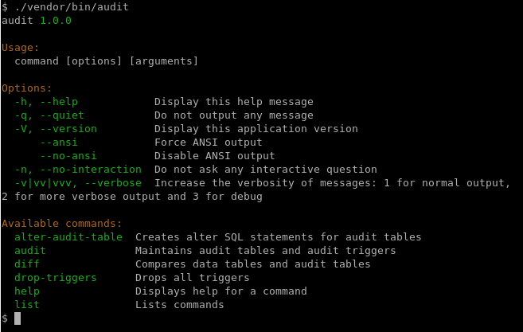
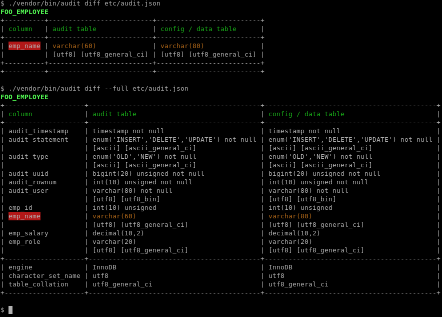
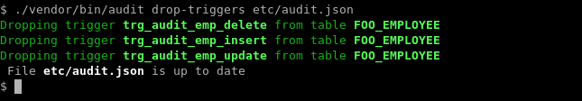

The PhpAudit Program
====================

The PhpAudit program is a `Symphony console application`_  with four additional commands:

 * ``alter-audit-table``
 * ``audit``
 * ``diff``
 * ``drop-triggers``

We discuss the additional commands in the sections below.

Some commands provide additional output when in verbose mode (``-v``). All commands show the queries been executed in very verbose mode (``-vv``).

.. _alter-audit-table-command:

The ``alter-audit-table`` command
---------------------------------

The ``alter-audit-table`` command generates SQL statements to align the tables in the ``audit schema`` with the tables in the ``data schema`` and the additional columns section in the audit config file, see :ref:`audit-columns-section`.

.. code:: sh

  ./vendor/bin/audit alter-audit-table etc/audit.json

Output:

.. code:: sql

  alter table `test_audit`.`FOO_EMPLOYEE`
  change column `emp_name` `emp_name` varchar(80) character set utf8 collate utf8_general_ci null
  ;

You must inspect each SQL statement manually before executing. See :ref:`changed-column-type` for an explanation about incompatible column types.

.. _audit-command:

The ``audit`` command
---------------------

The ``audit`` command creates and alters audit tables (in the ``audit schema`` and audit triggers on tables in the ``data schema``.

Usage of the ``audit`` command is discussed ind detail in :ref:`getting-started` and :ref:`schema-changes-and-deployment`.

.. _diff-command:

The ``diff`` command
--------------------

The diff command show in a graphical manner the differences between the tables in the ``audit schema`` with the tables in the ``data schema`` and the additional columns section in the audit config file, see :ref:`audit-columns-section`.

Without the ``--full`` option only tables with differences and only different columns are shown. With the ``--full`` option all tables and all columns are shown.

.. _drop-triggers-command:

The ``drop-triggers`` command
-----------------------------

The ``drop-triggers`` command will drop all triggers in the ``data schema``.

.. _`Symphony console application`: https://symfony.com/doc/current/components/console.html
